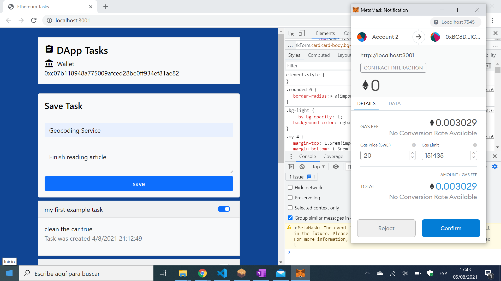

# Blockchain Ethereum Contract

* Truffle Framework used to create an Ethereum app using Javascript and Solidity.
* Code from [Fazt Code](https://www.youtube.com/channel/UCMn28O1sQGochG94HdlthbA) - see [:clap: Inspiration](#clap-inspiration) below
* **Note:** to open web links in a new window use: _ctrl+click on link_


## :page_facing_up: Table of contents

* [:zap: Angular Python Charts](#zap-angular-python-charts)
  * [:page_facing_up: Table of contents](#page_facing_up-table-of-contents)
  * [:books: General info](#books-general-info)
  * [:camera: Screenshots](#camera-screenshots)
  * [:signal_strength: Technologies](#signal_strength-technologies)
  * [:floppy_disk: Setup](#floppy_disk-setup)
  * [:flashlight: Testing](#flashlight-testing)
  * [:computer: Code Examples](#computer-code-examples)
  * [:cool: Features](#cool-features)
  * [:clipboard: Status & To-Do List](#clipboard-status--to-do-list)
  * [:clap: Inspiration](#clap-inspiration)
  * [:file_folder: License](#file_folder-license)
  * [:envelope: Contact](#envelope-contact)

## :books: General info

* Ethereum blockchain app is written in Solidity, similar to Javascript
* The app is a simple todo list with title & description strings, integer id & date fields with a boolean 'done' field
* Truffle suite includes Ganache, required to run the tests

## :camera: Screenshots




## :signal_strength: Technologies

* [Truffle Suite](https://www.trufflesuite.com/) tools for smart contracts
* [@truffle/contract](https://www.npmjs.com/package/@truffle/contract) Ethereum contract abstraction, for Node & browser.
* [Ganache](https://www.trufflesuite.com/ganache) framework to run Ethereum blockchain apps
* [Ethereum](https://ethereum.org/en/dapps/) decentralised app (DApps)
* [Solidity v0.8.6](https://docs.soliditylang.org/en/v0.8.6/) a curly-bracket language, object-oriented, high-level language for implementing smart contracts
* [Javascript testing](https://www.trufflesuite.com/docs/truffle/testing/writing-tests-in-javascript) using the [Mocha framework](https://mochajs.org/) and the [Chai assertion library](https://www.chaijs.com/)
* [Node.js v14.17.0](https://nodejs.org/en/) JavaScript runtime built on Chrome's V8 JavaScript engine.
* [lite-server v2.6](https://www.npmjs.com/package/lite-server) node server
* [Bootstrap v5](https://www.npmjs.com/package/bootstrap/v/5.0.0-alpha1) frontend framework
* [Google Material Fonts](https://fonts.google.com/icons)
* [MetaMask website](https://metamask.io/) & [MetaMask Chrome Extension](https://chrome.google.com/webstore/detail/metamask/nkbihfbeogaeaoehlefnkodbefgpgknn/related?hl=en) browser Ethereum wallet to use blockchain app

## :floppy_disk: Setup

**Solidity code:**
* `truffle console` to start Truffle command prompt
* `truffle migrate` to compile app

**Frontend:**
* `npm run dev` for a server-lite dev server

## :flashlight: Testing

* `truffle test` to run tests on Solidity code - Ganache has to be running

## :computer: Code Examples

* `contracts/TasksContract.sol` extract - In order to make events stand out with regards to regular function calls, emit TaskCreated(var1, var2...) as opposed to just EventName() is used to "call" the TaskCreated function.

```solidity
function createTask(string memory _title, string memory _description) public {
  taskCounter++;
  tasks[taskCounter] = Task(taskCounter, _title, _description, false, block.timestamp);
  emit TaskCreated(taskCounter, _title, _description, false, block.timestamp);
}
```

## :cool: Features

* connects with MetaMask Ethereum wallet Chrome Extension - see top screen print

## :clipboard: Status & To-Do List
* Working
* To-Do: Replace Bootstrap cards etc. with new style

## :clap: Inspiration

* [Fazt Code: Solidity & Javascript App - Ethereum Aplicacion Decentralizada](https://www.youtube.com/watch?v=FAMWIoKvfRs&t=76s) in Spanish
* [Aniket: ‘emit’ keyword in Solidity](https://aniketengg.medium.com/emit-keyword-in-solidity-242a679b0e1a)
* [Ethereum questions: Smart contract now vs javascript now](https://ethereum.stackexchange.com/questions/68217/smart-contract-now-vs-javascript-now/68218) explains how Javascript's timestamp is always a factor of 1000 larger than the one used by Solidity

## :file_folder: License

* N/A

## :envelope: Contact

* Repo created by [ABateman](https://github.com/AndrewJBateman), email: gomezbateman@yahoo.com
